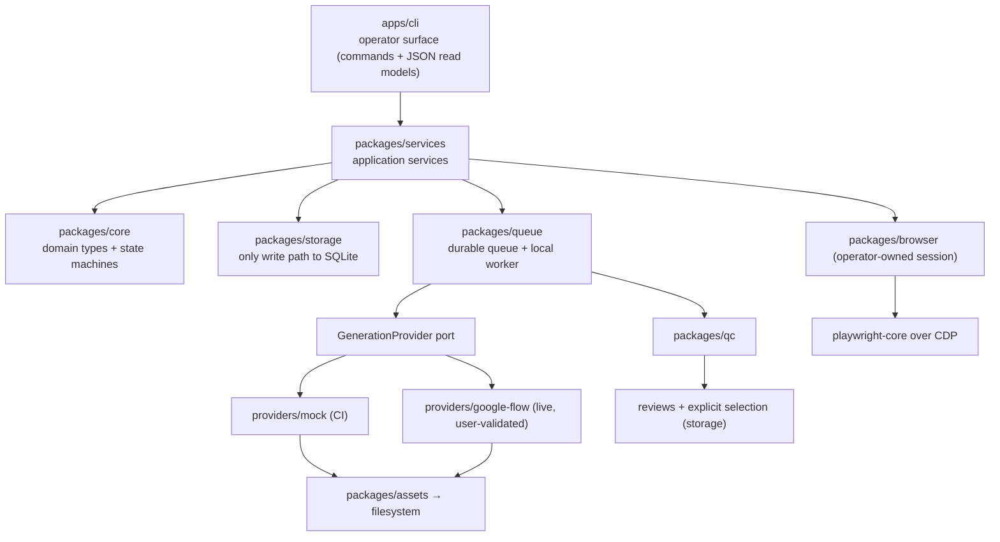

# Application services and operator surface (Phase 3 design note)

Status: implemented in `packages/services` (application layer) and `apps/cli` (operator
surface). This note is the design contract that implementation was written against.

## 1. Where the application layer sits



Phase 0/1/2 systems are **reused, not replaced**. The service layer adds no queue, no
retry engine, no storage, no browser automation, no provider selectors, and no asset
byte handling. It owns three things only: **validation, orchestration, and operator read
models**.

## 2. Service boundaries

| Service | Owns | Explicitly does not own |
| --- | --- | --- |
| `ProjectService` | project creation (validated), project lookup, project overview read model | scene/queue mutation, provider choice |
| `SceneService` | scene creation, immutable scene-version snapshots, current-pointer movement, guarded scene status transitions, scene timeline read model | generation, QC, selection |
| `GenerationService` | request validation → idempotent job creation (which enqueues atomically) → status projection; cancel and retry commands | claiming, execution, retry scheduling, backoff, browser work, asset writes |
| `QueueService` | queue depth/inspection read models and **worker execution driving** (`runOnce`, `runUntilIdle`) behind a provider-coverage guard | lease SQL, retry transitions, recovery SQL (delegates to `SqliteJobRepository`/`LocalQueueWorker`) |
| `ReviewService` | review queue read model, explicit APPROVE/REJECT decision, explicit approved+QC-passing selection | selection heuristics, auto-approval, QC recomputation |
| `ProductionService` | derived production-readiness projection per scene/project and the guarded `READY` transition | new state source of truth |

Shared construction lives in `createApplication()` (`packages/services`), which wires an
already-open repository, queue, optional worker, and optional provider registry.

## 3. Command/query split

* **Commands** (write): validated, then delegated to the single method that owns the
  durable transition — `repository.createProject/createScene/createSceneVersion/
  setCurrentSceneVersion/updateSceneStatus/createGenerationJob/cancelGenerationJob/
  retryFailedJob/decideReview/selectApprovedAssetVersion`, or `worker.runOnce/
  runUntilIdle/cancel`. A command never performs two writes that the repository does not
  already wrap in one `BEGIN IMMEDIATE` transaction.
* **Queries** (read): pure composition of existing repository reads into operator read
  models (`packages/services/src/read-models.ts`). They never mutate, never claim, and
  never extend a lease. Commands return the same read models plus the created identity, so
  a CLI run and a status poll share one shape.

## 4. State transitions and invariants

* Job status transitions remain exclusively `packages/core` `JOB_TRANSITIONS`, enforced in
  storage (`assertTransition`). Services never set a job status.
* `completeGeneration` remains the only path to `SUCCEEDED`; it persists bytes → asset
  version → QC → PENDING review → terminal job status in one transaction. Selection stays
  explicit.
* Scene status is the one transition the services layer newly exposes. It is guarded by the
  added `SCENE_STATUS_TRANSITIONS` table in `packages/core`
  (`DRAFT → READY|ARCHIVED`, `READY → DRAFT|ARCHIVED`, `ARCHIVED → ∅`) and re-checked by
  `repository.updateSceneStatus`, so no caller can skip the domain rule. `READY` requires
  derived readiness (below); there is no new status value and no schema migration — the
  `scenes.status` column already exists.
* Deterministic QC is a gate, not an approval. Selection requires review `APPROVED` **and**
  QC `PASSED`, which `selectApprovedAssetVersion` already enforces; `ReviewService` surfaces
  the same rule as a typed error instead of duplicating it.
* Production readiness is **derived, never stored**:
  `NO_CURRENT_SCENE_VERSION`, `NO_GENERATED_ASSET_FOR_VERSION`, `GENERATION_IN_PROGRESS`,
  `NO_SELECTED_ASSET_VERSION`, `QC_NOT_PASSED`, `REVIEW_NOT_APPROVED`,
  `SELECTED_VERSION_NOT_CURRENT`. `productionReady` is true only when the list is empty.

## 5. Persistence and recovery responsibilities

* `packages/storage` remains the only writer of `flowforge.db`; services hold no SQL, no
  file handles, and no `better-sqlite3` import.
* Idempotency: the request's canonical key (`provider|sceneVersionId|mode|outputCount`) is
  computed by the repository; `GenerationService` reports `created: true|false` by comparing
  the returned job against the key before insert, so a retried operator command reuses the
  existing job and never double-enqueues.
* Recovery: expired leases and orphan recovery remain `SqliteJobRepository` /
  `LocalQueueWorker` behaviour (`recoverExpiredLeases`, `orphan_recovery` attempts, the
  `UNCERTAIN_PROVIDER_STATE` no-auto-retry rule, the durable recovery manifest).
  `QueueService.recoverLeases()` only *invokes* that existing path and reports counts.
* Uncertain-submission safety: `QueueService` refuses to drive work whose provider is not
  configured (`PROVIDER_COVERAGE_INCOMPLETE`) rather than letting the durable worker
  permanently fail a mismatched job, and the CLI never marks a provider's work submitted
  without durable evidence.

## 6. Operator-facing read models

`packages/services/src/read-models.ts` (plain serialisable objects, stable field names, safe to
`JSON.stringify`): `ProjectOverview`, `SceneListItem`, `SceneDetail`, `SceneVersionSummary`,
`GenerationStatus`, `AttemptSummary`, `QueueStatus`, `QueueItemRow`, `ReviewQueueItem`,
`SelectedAsset`, `ProductionReadiness`, `ProjectProductionSummary`. Counts come from the
repository (`countGenerationJobs`, `queueSize`, `listQueueItems`) instead of being
reconstructed in the CLI. Long prompt text is omitted from list/board projections and shown
only in detail projections.

## 7. Operator surface

`apps/cli` gains a subcommand router. The legacy root invocation (no subcommand →
`vertical-slice`) is preserved so `corepack pnpm vertical-slice` and
`docs/vertical-slice.md` stay valid. Commands are: `project create|list|show`,
`scene create|list|show|version add|version set-current|status set`,
`generate`, `status`, `queue status|run|recover`, `cancel`, `retry`,
`review list|show|approve|reject|select`, `production scene|project`. Output is
`--json` (machine-readable) or a human summary; both are generated from the same read
model. Exit codes: `0` success, `1` application/domain error, `2` usage error, `3`
operator-blocking state (readiness not satisfied, provider coverage incomplete).

## 8. Operator command reference

```text
flowforge help                                   all commands and global flags
flowforge vertical-slice [flags]                 Phase 1 demo (also the flag-only default)

flowforge project create|list|show|archive
flowforge scene  create|list|show
flowforge scene  version add|list|set
flowforge scene  status set --status DRAFT|ARCHIVED
flowforge generate                               create or reuse the idempotent job
flowforge status --job-id ID | --scene-id ID
flowforge queue  status|run|recover
flowforge cancel --job-id ID [--local-only]
flowforge retry  --job-id ID [--available-at ISO]
flowforge review list|show|approve|reject|select|selected
flowforge production scene|ready|reopen|project
flowforge provider list
```

Global flags select the durable wiring, not the intent: `--data-dir`, `--provider mock|google-flow`,
`--mode`, `--artifact`, `--cdp-endpoint`, `--lease-ms`, `--retry-delay-ms`, `--max-attempts`,
`--json`. `--provider` doubles as the request provider for `generate` and as the served provider for
`queue run`, which is exactly what the coverage guard compares against. A read, an enqueue, or a
review command never attaches to the browser; only execution with `--provider google-flow` connects
to the operator's CDP session, and a missing session fails as `PROVIDER_SESSION_UNAVAILABLE` with a
redacted endpoint rather than being reported as provider failure.

Typical first run:

```sh
node apps/cli/dist/index.js project create --project-id pilot --name "Pilot"
node apps/cli/dist/index.js scene create --project-id pilot --scene-id scene-1 --title "Opening shot"
node apps/cli/dist/index.js scene version add --scene-id scene-1 --prompt "A lantern lights a dark stairwell at dusk."
node apps/cli/dist/index.js generate --project-id pilot --scene-id scene-1
node apps/cli/dist/index.js queue run --all
node apps/cli/dist/index.js review approve --asset-version-id <id> --reviewer <name>
node apps/cli/dist/index.js review select --scene-id scene-1 --asset-version-id <id>
node apps/cli/dist/index.js production ready --scene-id scene-1
```

## 9. Verification record (2026-10-04)

- `corepack pnpm build` and `corepack pnpm typecheck` — pass across the workspace (11 packages).
- `corepack pnpm test` — 75 tests pass: `packages/core` 2 (scene/project transition tables),
  `packages/storage` 7 (guarded status writes, reuse reporting, operator listing filters),
  `packages/queue` 7, `packages/qc` 4, `packages/browser` 10, `providers/google-flow` 22,
  `packages/services` 18 (full chain, idempotency, capability admission, coverage guard,
  cancellation, retry/uncertain-state rules, review conflicts, readiness transitions, lease
  recovery, fake-port unit cases), `apps/cli` 5 (end-to-end operator commands, human vs JSON
  projections, coverage refusal with exit 3, usage errors, legacy vertical slice).
- `corepack pnpm vertical-slice` — passes unchanged (job `SUCCEEDED`, queue `ACKED`, QC `PASSED`,
  review `APPROVED`, selected asset version printed).
- No Google account, browser session, or network access was used; live Flow execution through
  these commands is **NOT RUN** and is not claimed as validated.

## 10. Deliberately out of scope

No web UI, no HTTP API, no daemon, no service worker, no AI planner, no multi-agent
orchestration, no publishing, no billing/analytics, no full video pipeline, no live
Google Flow validation. `BrowserSessionLauncher` and the Google Flow manual-auth gate are
unchanged. Redis/Kafka/RabbitMQ/Kubernetes remain excluded (D-014/D-015/D-016).

## 10. Phase 4A continuation

Phase 4A extends these services with the creative planning domain — `CreativeBriefService`,
`PlanningDefinitionService`, `ProductionPlanService`, `PlanningValidationService`, and
`PlanningReadService` — over the same conventions established here: a narrow structural repository port,
command validation before any write, one durable owner per state change, shared read models for humans
and `--json`, and typed error codes with exit code `3` for operator-blocking states. `createApplication`
gains an optional `planning` dependency, so every existing caller in this document behaves exactly as
before, and planning access without it fails with `PLANNING_NOT_CONFIGURED` instead of a `TypeError`.

Planning is a layer *above* this one: no service here changed its queue, worker, retry, capability, or
review behaviour, and the planning services own no execution path. The model, lifecycle, validation
rules, persistence shape, idempotency keys, CLI, and verified walkthrough live in
[docs/planning-domain.md](./planning-domain.md).
